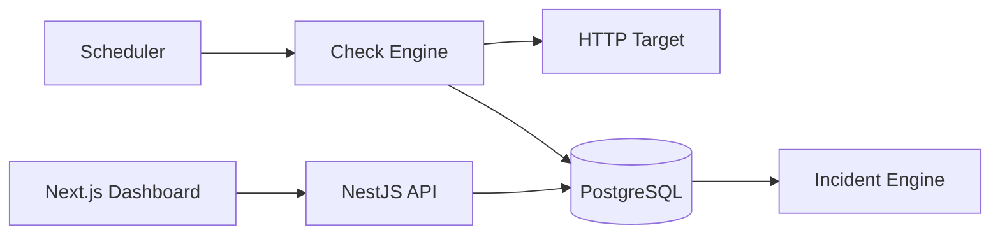

# PulseWatch

**Service Health & Uptime Monitor**

> A full-stack reliability portfolio application that schedules HTTP health
> checks, records latency and availability, opens incidents after repeated
> failures, and visualizes service health over time.


---

## 1. Overview

PulseWatch periodically checks configured HTTP endpoints, records each result
with its status and latency, moves targets through a health state machine,
opens an incident once failures cross a threshold, resolves it once the service
recovers, and presents current and historical health in a dashboard.

It is a monorepo: a NestJS API that owns the scheduler, check engine and
incident logic, and a Next.js dashboard that reads it.

## 2. What this demonstrates

- Scheduled background work with a **single coordinator**, due-target selection
  and a concurrency cap — not one timer per database row
- A **failure/recovery state machine** with thresholds, implemented as a pure,
  exhaustively tested function
- **Incident lifecycle** with a database-enforced "one active incident per
  target" guarantee
- **SSRF-hardened outbound HTTP**, including connect-time address validation
  and per-hop redirect re-validation
- **Sample-based uptime** and nearest-rank latency percentiles, with honest
  statements about what they do and do not measure
- **Transactional consistency** across four tables for a single check
- **Liveness vs readiness** done properly, including why monitored-target
  failures must not appear in the monitor's own readiness
- Relational modelling, migrations, indexes, pagination, retention
- RBAC, JWT, bcrypt, Helmet, throttling, validation, safe error surfaces
- Docker Compose with deterministic demo fixtures, and a documented scaling
  boundary

## 3. Disclaimer

> PulseWatch is an educational portfolio monitor. It is not intended to replace
> dedicated production observability, APM, synthetic monitoring, alerting, or
> incident-management platforms.

It contains no proprietary data. Every hostname, target and credential in this
repository is a local demo fixture.

## 4. Features

**Monitoring**

- HTTP/HTTPS checks with `GET` or `HEAD`, configurable per target
- Configurable expected status range (default `200-399`), interval (min 15s),
  timeout, and redirect policy
- Manual "check now" for operators, rate limited and race-safe
- Pause, resume and archive

**Health and incidents**

- `UNKNOWN / UP / DEGRADED / DOWN / PAUSED` states
- Configurable failure and recovery thresholds
- Automatic incident open on threshold, automatic resolve on recovery
- Acknowledgement and operator notes
- Append-only audit trail

**Metrics and UI**

- 24h / 7d / 30d uptime with sample counts
- Latency average, p50 and p95
- Uptime, latency and status-distribution charts
- Filtering and pagination everywhere
- Role-aware controls

**Operations**

- `/health` and `/health/ready` probes
- Configurable check-result retention with a daily prune job
- Swagger/OpenAPI
- Docker Compose with optional deterministic demo services

## 5. Architecture



Full detail, including the module map and the layering rule that keeps the HTTP
client ignorant of incidents: **[docs/ARCHITECTURE.md](docs/ARCHITECTURE.md)**.

## 6. Health model

| Status     | Meaning                                                  |
| ---------- | -------------------------------------------------------- |
| `UNKNOWN`  | Never checked yet, or just resumed                       |
| `UP`       | Last check succeeded, no recovery pending                |
| `DEGRADED` | Some consecutive failures, below the threshold           |
| `DOWN`     | Failure threshold reached, or recovery not yet complete  |
| `PAUSED`   | Checks disabled; the scheduler skips the target          |

`DEGRADED` exists so a single transient failure never becomes an outage
incident. Details: **[docs/HEALTH_MODEL.md](docs/HEALTH_MODEL.md)**.

## 7. Liveness vs readiness

```text
GET /api/v1/health        -> process alive
GET /api/v1/health/ready  -> PostgreSQL reachable + scheduler initialized
```

Monitored-target failures are deliberately **excluded** from readiness. A
customer endpoint being `DOWN` is the product working correctly; taking the
monitor out of rotation at that moment would be exactly backwards.

## 8. Check scheduler

One `setInterval`, registered once, ticking every `SCHEDULER_TICK_SECONDS`
(default 15). Each tick selects targets whose
`last_checked_at + interval_seconds` has elapsed and runs them in batches of
`MAX_CONCURRENT_CHECKS`. There is no cron decorator per target, so adding a
target is a pure data change.

Details: **[docs/CHECK_ENGINE.md](docs/CHECK_ENGINE.md)**.

## 9. Failure / recovery thresholds

```env
FAILURE_THRESHOLD=3     # consecutive failures before DOWN + incident
RECOVERY_THRESHOLD=2    # consecutive successes before UP + incident resolved
```

| Check | Result  | Status     | Incident     |
| ----- | ------- | ---------- | ------------ |
| 1     | fail    | `DEGRADED` | —            |
| 2     | fail    | `DEGRADED` | —            |
| 3     | fail    | `DOWN`     | **OPEN**     |
| 4     | success | `DOWN`     | still open   |
| 5     | success | `UP`       | **RESOLVED** |

This exact sequence is asserted by the unit tests *and* executed end-to-end by
`scripts/smoke-test.sh` against a real container.

## 10. Incident lifecycle

```text
OPEN --acknowledge--> ACKNOWLEDGED --recovery--> RESOLVED
  \------------------- recovery -------------------/
```

Only one active incident per target, enforced in service logic *and* by a
PostgreSQL partial unique index:

```sql
CREATE UNIQUE INDEX uq_incidents_one_active_per_target
  ON incidents (target_id) WHERE status <> 'RESOLVED';
```

Acknowledging is not resolving. Resolution means the service actually
recovered, so there is intentionally no "close incident" button.

## 11. Uptime calculation

```text
uptimePercent = successfulChecks / totalCompletedChecks * 100
99.25% uptime (397 successful / 400 checks)
```

Only checks that exist are counted; time before monitoring began is never
counted as uptime; zero samples renders as "no data", never 100%. This is
**sample-based, not duration-weighted** — the difference, with worked examples,
is in **[docs/UPTIME_CALCULATION.md](docs/UPTIME_CALCULATION.md)**.

## 12. Latency metrics

Measured on a monotonic clock (`process.hrtime.bigint()`). Average, p50 and p95
via PostgreSQL `PERCENTILE_DISC` — the nearest-rank definition, so a reported
p95 is a latency that was actually observed. Failures are excluded, since a
5000 ms timeout measures the timeout setting rather than the service. No p99 is
claimed, because small windows cannot support it.

## 13. SSRF defence

Monitoring arbitrary URLs is SSRF as a product feature, so it gets four layers:

1. **Scheme and syntax** — `http`/`https` only; credentials, over-long and
   malformed URLs rejected
2. **Address policy** — `ipaddr.js` classification allowlisting only `unicast`;
   loopback, RFC1918, link-local (including cloud metadata), multicast, CGNAT
   and the IPv6 equivalents blocked
3. **Connect-time validation** — a guarded DNS `lookup` handed to `undici`, so
   the address actually dialled is the one validated, closing the
   resolve-then-connect TOCTOU window that enables DNS rebinding
4. **Redirect validation** — automatic following disabled; every hop re-runs
   layers 1-3, capped at `maxRedirects`

`ALLOW_PRIVATE_TARGETS` defaults to `false`. Residual limitations are listed
honestly — this project does **not** claim complete SSRF prevention. See
**[docs/SSRF_DEFENSE.md](docs/SSRF_DEFENSE.md)**.

## 14. Technology stack

| Layer     | Choice                                                                    |
| --------- | ------------------------------------------------------------------------- |
| Frontend  | Next.js 14 (App Router), React 18, TypeScript, Tailwind CSS, TanStack Query, React Hook Form, Zod, Recharts |
| Backend   | Node.js 22, NestJS 10, TypeScript, TypeORM, PostgreSQL 16, `@nestjs/schedule`, JWT, bcrypt, class-validator, Swagger |
| HTTP      | `undici` with a custom dispatcher for connect-time SSRF validation        |
| Security  | Helmet, CORS allowlist, `@nestjs/throttler`, `ipaddr.js`                  |
| Tooling   | Jest, ESLint, Prettier, Docker, Docker Compose                            |

**Redis is intentionally not required for v1.** A multi-instance scheduler
would need distributed coordination — a database advisory lock,
`SELECT ... FOR UPDATE SKIP LOCKED`, leader election, or a dedicated worker
architecture. Adding Redis for a single lock is not justified when PostgreSQL
is already the shared dependency.

## 15. Database model

```text
User            id, name, email, passwordHash, role, timestamps
MonitorTarget   id, name, url, method, expectedStatusMin/Max, intervalSeconds,
                timeoutMs, followRedirects, maxRedirects, enabled, archived,
                status, consecutiveFailures, consecutiveSuccesses,
                lastCheckedAt, lastSuccessAt, lastFailureAt, timestamps
CheckResult     id, targetId, status, httpStatus, latencyMs, errorType,
                errorMessage, checkedAt, createdAt
Incident        id, targetId, status, startedAt, acknowledgedAt,
                acknowledgedById, resolvedAt, failureCountAtOpen, summary
IncidentNote    id, incidentId, authorId, content, timestamps
AuditEvent      id, actorId, action, entityType, entityId, metadata, createdAt
```

UUID primary keys, foreign keys with explicit `ON DELETE` behaviour, TypeORM
migrations (no `synchronize`), a `CHECK` constraint on the status range, and:

```text
check_results   (target_id, checked_at)
check_results   (status, checked_at)
incidents       (target_id, status)
incidents       (target_id) WHERE status <> 'RESOLVED'   -- partial UNIQUE
monitor_targets (status), (enabled)
```

### Data volume

A 60-second interval means roughly:

```text
1,440 checks/day/target
43,200 checks/30 days/target
432,000 checks in 30 days for 10 targets
```

Which is precisely why this project has indexes, retention, pagination and
bucketed chart aggregation rather than loading raw rows into the browser.

## 16. Setup

### Prerequisites

Node.js 20+ and either Docker (recommended) or a local PostgreSQL 16.

### Docker — the fast path

```bash
git clone https://github.com/shahiqimam/system-health-monitor.git
cd system-health-monitor
cp .env.example .env
docker compose -f docker-compose.yml -f docker-compose.demo.yml --profile demo up --build -d
docker compose exec -T api node dist/database/seed.js
```

Then open <http://localhost:3000> and sign in as `admin@pulsewatch.local` /
`AdminPass123!`.

### Local development

```bash
npm ci
# point .env at your PostgreSQL, then:
npm run migration:run
npm run seed --workspace apps/api
npm run start:dev --workspace apps/api   # API  on :3001
npm run dev --workspace apps/web         # Web  on :3000
```

Migrations also run automatically on API boot (`migrationsRun: true`).

## 17. Environment

```env
NODE_ENV=development

POSTGRES_DB=pulsewatch
POSTGRES_USER=pulsewatch
POSTGRES_PASSWORD=change_me

DATABASE_HOST=localhost
DATABASE_PORT=5432
DATABASE_NAME=pulsewatch
DATABASE_USER=pulsewatch
DATABASE_PASSWORD=change_me

JWT_SECRET=replace_with_long_random_value
JWT_EXPIRES_IN=1h

API_PORT=3001
WEB_PORT=3000
CORS_ORIGIN=http://localhost:3000
SWAGGER_ENABLED=true
NEXT_PUBLIC_API_URL=http://localhost:3001/api/v1

SCHEDULER_TICK_SECONDS=15
MAX_CONCURRENT_CHECKS=10
DEFAULT_CHECK_INTERVAL_SECONDS=60
MIN_CHECK_INTERVAL_SECONDS=15
DEFAULT_TIMEOUT_MS=5000
FAILURE_THRESHOLD=3
RECOVERY_THRESHOLD=2
CHECK_RETENTION_DAYS=30
ALLOW_PRIVATE_TARGETS=false
```

Two that matter more than the rest:

- `JWT_SECRET` — replace it. The fallback is a development placeholder.
- `ALLOW_PRIVATE_TARGETS` — must stay `false` on anything internet-exposed.
  The API logs a warning on boot whenever it is enabled.

`NEXT_PUBLIC_API_URL` is inlined at **web build time**; changing it requires
rebuilding the web image.

## 18. Docker

```text
web       Next.js standalone        :3000
api       NestJS                    :3001   ->  postgres:5432
postgres  PostgreSQL 16             :5432   named volume pulsewatch_pgdata
```

```bash
docker compose up --build -d            # core stack, secure defaults
docker compose logs -f api
docker compose down                     # keep data
docker compose down -v                  # drop the volume too
```

Inside the Compose network the API reaches the database at the service name
`postgres`, never `localhost` — see case 11 of
[docs/TROUBLESHOOTING.md](docs/TROUBLESHOOTING.md).

## 19. Demo services

Two throwaway fixtures behind the `demo` Compose profile, so the demo never
depends on a third-party internet endpoint:

| Service        | Port | Behaviour                                              |
| -------------- | ---- | ------------------------------------------------------ |
| `demo-healthy` | 8081 | `GET /health` always returns 200                       |
| `demo-flaky`   | 8082 | `GET /health` returns 200 or 503, toggled via `/admin` |

```bash
docker compose -f docker-compose.yml -f docker-compose.demo.yml --profile demo up --build -d
curl http://localhost:8082/admin/fail    # force 503
curl http://localhost:8082/admin/heal    # back to 200
```

These are **test fixtures, not production architecture**. They live on the
private Docker bridge network, which is why the demo overlay — and only the
demo overlay — sets `ALLOW_PRIVATE_TARGETS=true`.

## 20. Migrations

```bash
npm run migration:run --workspace apps/api
npm run migration:revert --workspace apps/api
```

TypeORM with `synchronize: false` everywhere. The initial migration creates all
enums, tables, foreign keys, indexes, the status-range `CHECK` constraint and
the partial unique index for active incidents. `migrationsRun: true` means a
fresh container converges on boot.

## 21. Swagger

```text
http://localhost:3001/api/docs
```

Documents auth, target configuration, incidents, metrics, pagination and every
status enum. Served when `SWAGGER_ENABLED=true` (default outside production).

## 22. Testing

```bash
npm run lint     # ESLint across both workspaces
npm test         # Jest unit/integration suite
npm run build    # nest build + next build
bash scripts/smoke-test.sh   # end-to-end, against a running stack
```

**76 tests** covering:

| Area           | What is asserted                                                          |
| -------------- | ------------------------------------------------------------------------- |
| Check engine   | 200 success, accepted 3xx, unexpected 500, narrowed range, timeout, connection refused, blocked scheme, allowed redirect, redirect limit, redirect to a blocked scheme, latency recorded |
| SSRF policy    | Every blocked scheme, credentialed URLs, over-long URLs, all required IPv4/IPv6 ranges, IPv4-mapped metadata addresses, local-lab override still rejecting unsafe schemes |
| State machine  | First failure degrades without an incident, threshold opens exactly one incident, further failures reuse it, first success stays DOWN, recovery threshold resolves |
| Metrics        | Sample-based uptime, no-sample `null`, all-failed `0`, rounding, nearest-rank p50/p95, single-sample and empty cases |
| RBAC           | Viewer read-only, operator allowed, operator blocked from admin routes, unauthenticated rejected |
| Concurrency    | Per-target lock prevents simultaneous checks, distinct targets run in parallel |

The check-engine tests run against a **local `http.createServer`**, never the
internet, so CI reliability never depends on a third-party endpoint.

`scripts/smoke-test.sh` drives the real stack: liveness, readiness, login,
SSRF rejection, healthy target `UP`, three failures through
`DEGRADED → DOWN` + incident, acknowledgement, a note, recovery through
`DOWN → UP` + automatic resolution, metrics, pause/resume (including `409` on a
paused target), archive — and, deliberately last, that the **scheduler checks a
target on its own**.

That final assertion exists because every other step drives the API through
`check-now`. A broken due-target query would leave all of them green while no
scheduled check ever ran; this repository shipped exactly that bug once, and
the guard is what would now catch it.

## 23. Screenshots

Capture guide and rules in **[docs/SCREENSHOTS.md](docs/SCREENSHOTS.md)**. The
image files are not committed yet; when they are, they will come from a real
running stack. No mock-ups.

## 24. Design decisions

**One scheduler coordinator, not a cron per target.** A due-query keeps the
number of timers constant as targets grow, survives restarts without
reconciliation, and makes adding a target a pure data change.

**The state machine is a pure function.** `computeHealthTransition` takes
counters and a result and returns a decision. No database, no clock, no I/O —
which is why every transition is unit-tested cheaply and exhaustively, and why
the caller can apply the whole decision inside one transaction.

**The check engine knows nothing about incidents.** It takes a target
description and returns a bounded result. Persistence, thresholds and incident
lifecycle live in `CheckRunnerService`. Mixing them would make the HTTP client
untestable without a database.

**Connect-time SSRF validation, not just creation-time.** Validating a URL when
it is saved is defeated by DNS rebinding. Handing `undici` a guarded `lookup`
means the address validated is the address dialled.

**Redirects are followed manually.** Letting the HTTP client follow them means
only the first URL is ever validated.

**Uptime returns `null` with no samples.** A brand-new target showing 100%
would be a lie, and the alternative — 0% — would be a different lie.

**`PERCENTILE_DISC`, not `PERCENTILE_CONT`.** A reported p95 should be a
latency that actually happened, not an interpolation between two samples.

**Pausing does not resolve incidents.** Otherwise "pause" becomes an
undocumented way to silently close an outage.

**Response bodies are never stored.** The monitor needs a status code and a
duration. Storing bodies would add an injection surface and unbounded growth
for no monitoring value.

**No Redis in v1.** The only thing that would need it is a distributed lock,
and PostgreSQL already offers advisory locks and `SKIP LOCKED`. Adding a
stateful service for one lock is not justified.

## 25. Security considerations

| Control                   | Implementation                                                   |
| ------------------------- | ---------------------------------------------------------------- |
| Password storage          | bcrypt, cost 10                                                  |
| Sessions                  | JWT; `JwtStrategy` re-reads the user per request, so a deleted or role-changed account cannot keep acting on a live token |
| Authorization             | `RolesGuard` server-side on every mutating route; the UI only hides controls |
| User enumeration          | Identical error for unknown email and wrong password             |
| Headers                   | Helmet                                                           |
| CORS                      | Exact-origin allowlist, not `*`                                  |
| Rate limiting             | Global 120/min; login 10/min; `check-now` 20/min                 |
| Input validation          | Global `ValidationPipe` with `whitelist`, `forbidNonWhitelisted`, `transform`; `ParseUUIDPipe` on every id |
| Outbound URL handling     | Scheme allowlist, credential rejection, length caps              |
| Outbound address handling | `ipaddr.js` range classification, validated again at connect time |
| Redirects                 | Off by default; every hop re-validated; hop cap                  |
| Outbound timeouts         | Per-target, applied to connect, headers, body and the total budget |
| Error surfaces            | `AllExceptionsFilter` returns bounded JSON; stack traces and driver internals are logged server-side only |
| Stored diagnostics        | Error messages sanitized and capped at 200 characters; no stack traces stored as check data |
| Response bodies           | Drained with a 64 KB cap, never stored                           |
| Secrets                   | Environment only; `.env` is git-ignored                          |

Target creation is `ADMIN`-only precisely because a monitor target is an
SSRF-sensitive input.

## 26. Scaling limitations

**This section is deliberately explicit.**

- **The scheduler runs in one API process.** `ScheduleModule` registers one
  interval in that process.
- **Multiple replicas would duplicate checks.** Every replica's tick selects
  the same due rows, because "due" is derived from `last_checked_at`, which is
  only written after a check completes. Duplicate samples inflate uptime
  denominators and cross failure thresholds early.
- **The concurrency limit is not distributed.** `MAX_CONCURRENT_CHECKS` bounds
  one process. Three replicas mean three times the outbound concurrency.
- **The per-target lock is process-local.** `TargetLockService` is a `Set` in
  memory and cannot prevent cross-process races.
- **High target counts need a different architecture.** Beyond roughly a few
  hundred targets, checking belongs in worker processes fed by a queue, with
  claims (`SELECT ... FOR UPDATE SKIP LOCKED`) or leader election.
- **Raw check volume grows quickly.** ~432,000 rows per 30 days for 10 targets
  on a 60-second interval. Retention is a requirement, not a nicety.
- **Larger systems need downsampling.** Querying raw rows for a 90-day chart
  does not scale; real systems roll up into hourly/daily aggregate tables.

Nothing here pretends single-instance scheduler semantics scale horizontally.

## 27. Known limitations

- HTTP(S) checks only
- No TCP, ICMP or DNS monitors
- No email, Slack or PagerDuty notifications
- No Prometheus metrics ingestion or export
- No distributed scheduler
- No high availability
- No real SLA calendar or maintenance-window accounting
- No multi-tenancy
- No public status page
- Single vantage point — a network fault between PulseWatch and a target is
  indistinguishable from the target being down
- Sample-based uptime cannot observe outages shorter than the check interval
- SSRF defence is layered but not absolute; see
  [docs/SSRF_DEFENSE.md](docs/SSRF_DEFENSE.md)

## 28. Future improvements

Documented, not implemented:

```text
worker queue
Redis distributed locks
public status page
maintenance windows
notifications
TCP/DNS checks
OpenTelemetry
Prometheus export
downsampling
multi-region probes
```

## 29. Interview topics

**[docs/INTERVIEW_NOTES.md](docs/INTERVIEW_NOTES.md)** covers 23 topics — health
checks, liveness, readiness, uptime, latency, p50/p95, HTTP status, DNS, TCP
timeouts, schedulers, cron, background jobs, race conditions, transactions,
incidents, SSRF, redirects, Docker networking, `localhost`, PostgreSQL indexes,
retention, horizontal scaling and distributed locks — each with a simple
answer, a technical answer, how this project uses it, and the question you are
likely to be asked.

Other documentation:

| Document                                            | Contents                                      |
| --------------------------------------------------- | --------------------------------------------- |
| [ARCHITECTURE.md](docs/ARCHITECTURE.md)              | Module map, layering, deployment topology     |
| [HEALTH_MODEL.md](docs/HEALTH_MODEL.md)              | States, thresholds, incident transitions      |
| [CHECK_ENGINE.md](docs/CHECK_ENGINE.md)              | Tick vs interval, concurrency, classification |
| [SSRF_DEFENSE.md](docs/SSRF_DEFENSE.md)              | Four layers and residual limitations          |
| [UPTIME_CALCULATION.md](docs/UPTIME_CALCULATION.md)  | Formula, worked examples, why it approximates |
| [REQUEST_LIFECYCLE.md](docs/REQUEST_LIFECYCLE.md)    | Traced call chain with real file names        |
| [TROUBLESHOOTING.md](docs/TROUBLESHOOTING.md)        | 12 failure cases with diagnostic sequences    |
| [SCREENSHOTS.md](docs/SCREENSHOTS.md)                | Capture guide                                 |

## 30. License

MIT — see [LICENSE](LICENSE).
