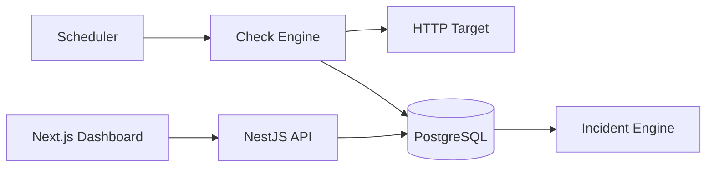

# Architecture

PulseWatch is a two-application monorepo backed by one PostgreSQL database.



```text
                         +-------------------+
                         | SchedulerService  |
                         | tick every 15s    |
                         +---------+---------+
                                   |
                                   v
+---------------+        +-------------------+
| MonitorTarget | -----> | CheckEngineService|
+---------------+        | SSRF + timeout    |
                         +---------+---------+
                                   |
                                   | HTTP(S)
                                   v
                          Monitored Endpoint
                                   |
                                   v
                         +-------------------+
                         | CheckRunnerService|
                         | result + state    |
                         | + incident (1 tx) |
                         +---------+---------+
                                   |
                                   v
                            PostgreSQL
                                   |
                    +--------------+-------------+
                    |                            |
                    v                            v
              NestJS REST API              Next.js UI
```

## Workspaces

| Path                | Purpose                                                        |
| ------------------- | -------------------------------------------------------------- |
| `apps/api`          | NestJS REST API, scheduler, check engine, incident engine       |
| `apps/web`          | Next.js dashboard (App Router, client-rendered, JWT in browser) |
| `demo-services/`    | Two throwaway HTTP fixtures used by the `demo` Compose profile  |
| `scripts/`          | Seed entry point and the end-to-end smoke test                  |
| `docs/`             | This documentation set                                          |

## API module map

| Module            | Responsibility                                                            |
| ----------------- | ------------------------------------------------------------------------- |
| `AuthModule`      | Login, JWT issuance, `JwtStrategy` (re-reads the user on every request)    |
| `UsersModule`     | User CRUD for admins, bcrypt hashing                                       |
| `ChecksModule`    | `UrlValidatorService`, `CheckEngineService`, `CheckRunnerService`, locks   |
| `SchedulerModule` | `SchedulerService` — the single tick coordinator                           |
| `TargetsModule`   | Target CRUD, pause/resume/archive, manual check, check history            |
| `IncidentsModule` | Incident listing/detail, acknowledgement, notes                           |
| `MetricsModule`   | Uptime and latency aggregation queries                                    |
| `DashboardModule` | Fleet-level summary, distribution, incident panels, series                |
| `RetentionModule` | Daily prune of old `CheckResult` rows + a manual CLI                      |
| `AuditModule`     | Append-only `AuditEvent` records                                          |
| `HealthModule`    | The monitor's own liveness and readiness probes                           |

## Layering rule

The HTTP client knows nothing about incidents, and the incident engine knows
nothing about sockets:

- `CheckEngineService` takes a plain target description and returns a bounded
  `CheckExecutionResult`. It performs no database access.
- `CheckRunnerService` owns persistence: it inserts the result, applies the
  state machine decision and opens/resolves incidents **inside one
  transaction**.
- `computeHealthTransition` is a pure function with no dependencies at all,
  which is why the state machine is exhaustively unit-tested without a
  database.

## Scheduling is registered exactly once

`ScheduleModule.forRoot()` appears only in `AppModule`. `SchedulerService`
registers a single named interval (`pulsewatch-check-tick`) in
`onModuleInit`. There is deliberately no cron decorator per database row.

## Data flow for one check

See [REQUEST_LIFECYCLE.md](./REQUEST_LIFECYCLE.md) for the traced call chain
with real class and file names.

## Deployment topology

```text
docker compose:
  web  (Next.js standalone)  :3000  ->  browser calls api directly
  api  (NestJS)              :3001  ->  postgres:5432
  postgres                   :5432      named volume pulsewatch_pgdata
  demo-healthy  (profile: demo) :8081
  demo-flaky    (profile: demo) :8082
```

The browser talks to the API directly using `NEXT_PUBLIC_API_URL`, which is
inlined at web build time. Inside the Compose network the API reaches the
database at the service name `postgres`, never `localhost`.

## Scaling boundary

Everything above assumes **one API process**. See the Scaling Limitations
section of the README and [CHECK_ENGINE.md](./CHECK_ENGINE.md) for what breaks
with replicas.
